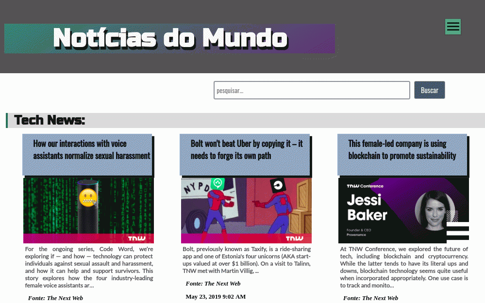

# Notícias do Mundo

## Objetivo: 

Repositório criado com propósito de estudo/criação de Aplicação Web usando ES6 - fetch API.

## Demo:

 *

## Funcionalidades:

Exibição de manchetes de notícias e pesquisa de artigos de portais mundiais em tempo real. 

## API:

[NewsApi](https://newsapi.org/)
 

